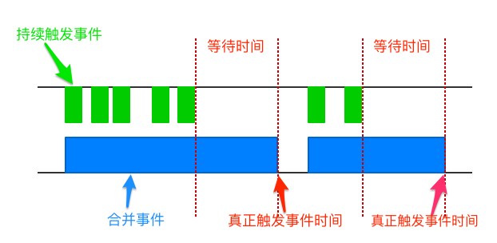

### 节流(throttle)与防抖(debounce)

> 一个老生常谈的技巧，为了解决一些类似 搜索框提示，按钮点击等需要频繁触发的函数，这些函数会加重浏览器和服务器的负担，导致用户体验不好

#### 防抖 debounce

**防抖**就是给定一个时间和函数，在这个时间到了之后才会执行函数，但是如果在这个时间内又调用了这个函数，那么就会重新开始计时，直到没有再次调用这个函数，并且到达给定的时间

实现一个简单的debounce：

```js
/**
 * @param fn 执行函数
 * @param delay 时间间隔
 * @param isImmediate 为true，debounce会在delay时间间隔的开始时立即调用这个函数
 * @returns {Function}
 */

function debounce(fn,delay,isImmediate){
    var timer = null;
    return function(){
		let ctx = this;
        let args = arguments; //取得参数
        clearTimeout(timer);
        if(isImmediate && timer === null){
            //时间间隔外立即执行
			fn.apply(ctx,args);
            timer = 0;
            return;
        }
        timer = setTimeout(function() {
      		fn.apply(context,args);
      		timer = null;
    	}, delay);
    }
}

```



#### 节流（throttle）

**节流**就是像一个止水阀，在规定的时间内，不管你触发了多少次事件，只有最后一个事件才会执行

简单实现：

```js
/**
 * 创建并返回一个像节流阀一样的函数，当重复调用函数的时候，最多每隔delay毫秒调用一次该函数
 * @param fn 执行函数
 * @param delay 时间间隔
 * @returns {Function}
 */
function throttle(fn, delay) {
  var timer = null;
  var timeStamp = new Date();
  return function() {
    var context = this;  //获取函数所在作用域this
    var args = arguments;  //取得传入参数
    if(new Date()-timeStamp>delay){
        timeStamp = new Date();
        timer = setTimeout(function(){
        fn.apply(context,args);
      },delay);
    }

  }
}
```


